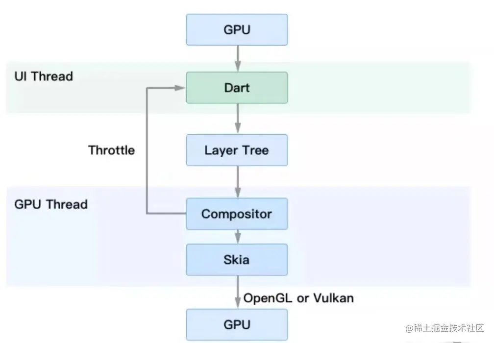

# Flutter介绍

## Flutter为什么选择Dart语法

> 1、**开发效率高**。Dart运行时和编译器支持Flutter的两个关键特性的组合，分别是基于JIT的快速开发周期和基于AOT的发布包。
>
> 2、**高性能。**Dart支持AOT。
>
> 3、**快速分配内存。**Flutter框架使用函数式流，这使得它在很大程度上依赖于底层的内存分配器。
>
> 4、**类型安全**

## Flutter框架

<figure><figcaption></figcaption></figure>

> Flutter Framework是一个完全由Dart语言构建的SDK，它实现了一整套自底而上的基础库。
>
> 1.底部两层(Foundation和Animation、Painting、Gestures)是Flutter引擎暴露的底层UI库，提供动画、手势及绘制能力。
>
> 2.Rendering层是一个抽象的布局层，它依赖于dart UI层。Rendering层会构建一个UI树，当UI树有变化时，它会随即计算出有变化的部分，然后更新UI树，最终将UI树绘制到屏幕上。这个过程类似于React中的虚拟DOM。Rendering层可以说是Flutter UI框架最核心的部分，它除了确定每个UI元素的位置、大小之外，还要进行坐标变换和绘制(调用底层dart:ui)。
>
> 3.Widgets层是Flutter提供的一套基础组件库，在基础组件库之上，Flutter还提供了 Material 和Cupertino两种视觉风格的组件库。
>
> Flutter Engine：这是一个完全由 C++实现的 SDK，其中包括了 Skia引擎、Dart运行时和文字排版引擎等。在代码调用 dart:ui库时，调用最终会走到Engine层，然后实现真正的绘制逻辑

## Flutter绘制原理

<figure><figcaption>
Flutter绘制原理
</figcaption></figure>

> * GPU将信号同步到UI线程
> * UI线程用Dart来构建图层树
> * 图层树在GPU线程中合成
> * 合成后的视图数据提供给SKia引擎
> * Skia引擎通过OpenGL或者Vulkan将显示内容提供给GPU，所以有两个GPU构成一个闭环
