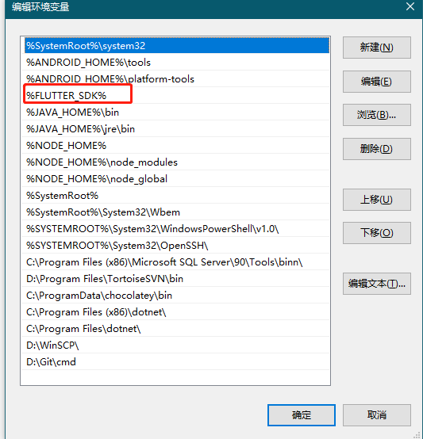

# 安装

\
系统配置要求 <a href="#system-requirements" id="system-requirements"></a>
-------------------------------------------------------------------

要想安装和运行 Flutter，你的开发环境至少应该满足如下的需求：

* **操作系统**：Windows 10 或更高的版本（基于 x86-64 的 64 位操作系统）。
* **磁盘空间**：除安装 IDE 和一些工具之外还应有至少 1.64 GB 的空间。
* **设置**: 必须在 Windows 10/11 上启用开发者模式。
* **工具**：要让 Flutter 在你的开发环境中正常使用，依赖于以下的工具：
  * [Windows PowerShell 5.0](https://docs.microsoft.com/en-us/powershell/scripting/install/installing-windows-powershell) 或者更高的版本（Windows 10 中已预装）
  *   [Git for Windows](https://git-scm.com/download/win) 2.x，并且勾选**从 Windows 命令提示符使用 Git** 选项。

      如果 Windows 版的 Git 已经安装过了，那么请确保能从命令提示符或者 PowerShell 中直接执行 git 命令。\


## 获取 Flutter SDK <a href="#get-the-flutter-sdk" id="get-the-flutter-sdk"></a>

> **请注意**
>
> 请勿将 Flutter 有特殊字符或空格的路径下。
>
> 请勿将 Flutter 安装在需要高权限的文件夹内，例如 `C:\Program Files\`。

1.  点击下方的安装包，获取 stable 发行通道的 Flutter SDK 最新版本：

    [flutter\_windows\_3.10.5-stable.zip](https://storage.flutter-io.cn/flutter\_infra\_release/releases/stable/windows/flutter\_windows\_3.10.5-stable.zip)

    要查看其他发行通道和以往的版本，请参阅 [SDK 版本列表](https://flutter.cn/docs/release/archive) 页面。
2. 将压缩包解压，然后把其中的 `flutter` 目录整个放在你想放置 Flutter SDK 的路径中（例如 `C:\src\flutter`）。


## 更新 path 环境变量 <a href="#update-your-path" id="update-your-path"></a>

如果你想在 Windows 控制台中运行 Flutter 命令，需要按照下面的步骤来将 Flutter 的运行文件路径加入到 `PATH` 环境变量。

* 在开始菜单的搜索功能键入「env」，然后选择 **编辑系统环境变量**。
* 在 **用户变量** 一栏中，检查是否有 **Path** 这个条目：
  * 如果存在这个条目，以 `;` 分隔已有的内容，加入 `flutter\bin` 目录的完整路径。
  * 如果不存在的话，在用户环境变量中创建一个新的 `Path` 变量，然后将 `flutter\bin` 所在的完整路径作为新变量的值。

你需要重新打开已经打开的命令行提示符窗口，这样下次启动命令提示符时，才能访问到刚才修改的变量。

.png>)


## 运行 `flutter doctor` <a href="#run-flutter-doctor" id="run-flutter-doctor"></a>

在将 `Path` 变量更新后，打开一个新的控制台窗口，然后执行下面的命令。如果它提示有任何的平台相关依赖，那么你就需要按照指示完成这些配置：

```
C:\src\flutter>flutter doctor
```

上述命令会检查你的现有环境，并将检测结果以报告形式呈现出来。仔细阅读它显示的内容，检查是否有尚未安装的软件或是有其他的步骤需要完成（通常会以**粗体**呈现）。

例如：

_content\_copy_

<pre class="language-markdown"><code class="lang-markdown">[-] Android toolchain - develop for Android devices
    • Android SDK at D:\Android\sdk
<strong>    ✗ Android SDK is missing command line tools; download from https://goo.gl/XxQghQ
</strong>    • Try re-installing or updating your Android SDK,
      visit https://flutter.cn/docs/setup/#android-setup for detailed instructions.
</code></pre>

<figure><figcaption></figcaption></figure>

## 设置 Android 开发环境 <a href="#android-setup" id="android-setup"></a>

### 下载安装Android Studio和JDK <a href="#install-android-studio" id="install-android-studio"></a>

> 官方下载地址：[https://developer.android.com/studio](https://developer.android.com/studio)
>
> 中国大陆搬运站：[https://www.androiddevtools.cn](https://www.androiddevtools.cn/)
>
> JDK下载：[https://www.oracle.com/java/technologies/downloads/](https://www.oracle.com/java/technologies/downloads/)
>
> 历史JDK版本：[https://www.oracle.com/java/technologies/downloads/archive/](https://www.oracle.com/java/technologies/downloads/archive/)

.png>).png>)

<figure><figcaption></figcaption></figure>


## Android和JDK环境变量配置

### 新建系统变量

> **JAVA\_HOME**
>
> D:\Java\JDK16
>
> **CLASSPATH**
>
> .;%JAVA\_HOME%\lib\dt.jar;%JAVA\_HOME%\lib\tools.jar;
>
> **ANDROID\_HOME**
>
> D:\Android\AndroidSDK

### Path添加路径

.png>)


### 配置检验

> java -version
>
> adb version

## .png>) <a href="#install-the-flutter-and-dart-plugins-1" id="install-the-flutter-and-dart-plugins-1"></a>

## 安装 Flutter 和 Dart 插件 <a href="#install-the-flutter-and-dart-plugins-1" id="install-the-flutter-and-dart-plugins-1"></a>



## Windows 设置 <a href="#windows-setup" id="windows-setup"></a>

对于 Windows 桌面开发而言，除了 Flutter SDK 以外你还需要以下内容：

* [Visual Studio 2022](https://visualstudio.microsoft.com/downloads/) 或 [Visual Studio 2022 生成工具](https://visualstudio.microsoft.com/downloads/#build-tools-for-visual-studio-2022) 在选择安装 Visual Studio 时或只安装生成工具的时候，你需要选择「使用 C++ 的桌面开发」，包括其所有默认组件，以安装必要的 C++ 工具链和 Windows SDK 的头文件。


