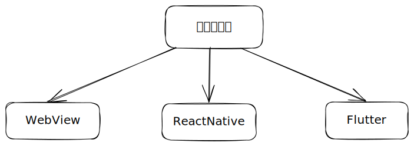

# 变量

## 不可变量：关键字<mark style="color:blue;background-color:blue;">const</mark>（编译时常量）和<mark style="color:blue;background-color:blue;">final</mark>（运行时常量）

````dart
```dart
main() {
  // t1不能再被赋值
  const String t1 = 't1'; 

  // 其他变量可以赋值给t2 (不推荐)
  final t2 = t1*2; 

  // t1 = t2;
}
```
````

## 可变量：默认数据类型和<mark style="color:blue;background-color:blue;">var</mark>&#x20;

## 数字<mark style="color:blue;background-color:blue;">num</mark> 类型是整形 <mark style="color:blue;background-color:blue;">int</mark> 和浮点型 <mark style="color:blue;background-color:blue;">double</mark> 的抽象类

````dart
```dart
main(){
  num a = 57;
  num b = 3.28;
  print("a:${a.runtimeType}===b:${b.runtimeType}");
}
```
````

## 字符串模版拼接

通过 `${变量}` 插入变量

````dart
```dart
main() {
  String addr = '逍遥津公园';
  String name = '小芳';
  String result = '今天我和${name}一起去$addr玩，很开心！';
  print(result);
}
```
````

## 聚合类型：<mark style="color:blue;background-color:blue;">List</mark> 列表 、<mark style="color:blue;background-color:blue;">Map</mark> 映射 、 <mark style="color:blue;background-color:blue;">Set</mark> 集合

### <mark style="color:blue;background-color:blue;">List</mark> 列表

增删改查

````dart
```dart
main() {
  List<String> cnNumUnits = ['零', '壹', '贰', '叁', '肆', '伍', '六', '柒', '捌', '玖'];
  // 添加元素有四个方法：add 和 addAll 方法用于在列表末尾添加元素；insert 和 insertAll 方法可以在指定索引 处添加元素。
  cnNumUnits.add('拾');
  cnNumUnits.add('佰');
  cnNumUnits.addAll(['仟', '萬', '亿']);
  cnNumUnits.insert(2, '点');
  cnNumUnits.insertAll(2, ['横', '撇']);
  print(cnNumUnits);
  // 删除元素其中2个是 removeAt 和 remove 方法，前者用于删除 指定索引 的元素，后者用于删除 某个元素值
  cnNumUnits.removeAt(2);
  cnNumUnits.removeAt(2);
  cnNumUnits.remove('点');
  print(cnNumUnits);
  // 修改元素值，可以通过 [] 指定索引，直接通过 = 赋值进行修改
  cnNumUnits[6] = '陆';
  print(cnNumUnits);

  // 访问
  print(cnNumUnits[6]); //陆
  print(cnNumUnits[9]); //玖

}
```
````

元素遍历

````dart
```dart
main() {
  List<String> cnNumUnits = ['零', '壹', '贰', '叁', '肆', '伍', '陆', '柒', '捌', '玖'];

  for (int i = 0; i < cnNumUnits.length; i++) {
    print(cnNumUnits[i]);
  }

  for (String element in cnNumUnits) {
    print(element);
  }

  cnNumUnits.forEach((String element) {
    print(element);
  });

  Iterator<String> it = cnNumUnits.iterator;
  while (it.moveNext()) {
    print(it.current);
  }
}
```
````

### <mark style="color:blue;background-color:blue;">Set</mark> 集合

`Set` 是无序的，没有索引的概念，所以无法通过 `[]` 对元素进行访问和修改。而 `List` 允许包含相同元素，和索引访问。

`Set` 对元素的维护，只有 `添加` 和 `移除` 的操作，遍历方式和 `List 一致`

`Set` 类似数学集合间的运算

````dart
```dart
main() {
  Set<String> cnNumUnits = {'零', '壹', '贰', '叁', '肆', '伍', '陆', '柒', '捌', '玖'};
  Set<String> part = {'零', '壹', '贰', '元', '角', '分'};

  cnNumUnits.intersection(part); // 交集
// {零, 壹, 贰}

  cnNumUnits.union(part); // 并集
// {零, 壹, 贰, 叁, 肆, 伍, 陆, 柒, 捌, 玖, 元, 角, 分}

  cnNumUnits.difference(part); // 补集
// {叁, 肆, 伍, 陆, 柒, 捌, 玖}
}
```
````


### <mark style="color:blue;background-color:blue;">Map</mark> 映射

增删改查

````dart
```dart
main() {
  Map<String,String> dict = {
    'about': '关于',
    'boot': '启动',
    'card': '卡片',
  };
  print(dict['card']);//查询
  dict['dog'] = '狗';
  dict['cat'] = '猫';//增加
  dict['boot'] = '启动,靴子';//修改
  print(dict.length);
  dict.remove('cat');//删除
}
```
````

元素遍历

````dart
// ```dart
main() {
  Map<String, String> dict = {'about': '关于', 'boot': '启动', 'card': '卡片'};
  dict.forEach((k, v) {
    // 这个闭包函数有两个参数: k 代表map的key, v 代表map的value值
    print(k + " = " + v.toString()); // 打印数据
  });
}
```
````

### 聚合类型的关系



````dart
```dart
main(){
  foo2();
}

foo0(){
  List<String> cnNumUnits = ['零', '壹', '贰', '叁','贰', '贰'];
  Set<String> cnNumSet = cnNumUnits.toSet();
  print(cnNumSet); // {零, 壹, 贰, 叁}
  List<String> cnNumUnique  = cnNumSet.toList();
  print(cnNumUnique); // [零, 壹, 贰, 叁]
}

foo1(){
  List<String> cnNumUnits = ['零', '壹', '贰', '叁', '肆', '伍', '陆', '柒', '捌', '玖'];
  Map<int,String> cnNumMap = cnNumUnits.asMap();
  print(cnNumMap);
}

foo2(){
  List<String> cnNumUnits = ['零', '壹', '贰', '叁', '肆', '伍', '陆', '柒', '捌', '玖','拾','佰','仟','萬'];
  Set<int> numUnitsSet = {0, 1, 2, 3, 4, 5, 6, 7, 8, 9,10,100,1000,10000};
  Map<int,String> map = Map.fromIterables(numUnitsSet,cnNumUnits);
  print(map);
}

foo3(){
  Map<String,String> dict = {'about': '关于', 'boot': '启动', 'card': '卡片'};
  dict.keys.toList();
  dict.values.toList();

  dict.keys.toSet();
  dict.values.toSet();
}

```
````
