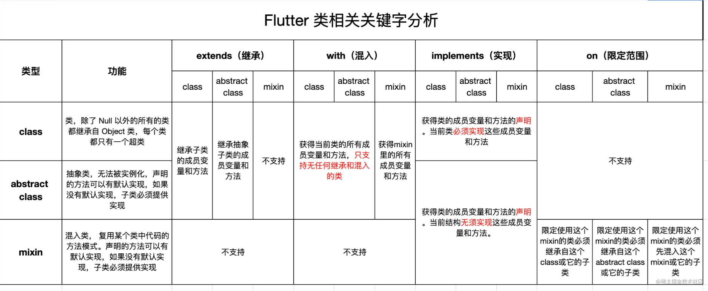

# 面向对象

## &#x20;<mark style="color:blue;background-color:blue;">get</mark> 和 <mark style="color:blue;background-color:blue;">set</mark> 关键字

`get` 关键字定义的方法，不能传参；`set` 关键字定义的方法，只能传一参。用于简单的成员变量的处理

```dart

import 'dart:math' as math;

void main() {
  Vec2 p0 = Vec2(4, 3);
  print(p0.length); // Vec2(4.0,3.0)
  p0.name = "P0";
  print(p0.getInfo());
}

class Vec2 {
  double x;
  double y;
  String? _name;
  Vec2(this.x, this.y);

  String getInfo() => "${name}Vec2($x,$y)";

  double get length => math.sqrt(x * x + y * y);

  String get name => _name ?? "";

  set name(String? value) {
    if(value == null){
      _name = "";
    }else{
      _name = value+": ";
    }
  }
}

```

## 构造方法

### 特点：

* 构造方法可以没有方法体。
* 在参数列表中可以通过 `this.成员` ，可以为成员变量进行赋值。
* 在构造方法的右括号后可以加 `:` 号，之后添加一些表达式，常用于对成员变量的初始化，多个表达式通过 `,` 号隔开。

<pre class="language-dart"><code class="lang-dart"><strong>import 'dart:math' as math;
</strong>
void main() {
  Vec2 p0 = Vec2(4, 3, name: "P0");
  print(p0.length); // Vec2(4.0,3.0)
  p0.name = "P0";
  print(p0.getInfo());

  Vec2 p1 = Vec2.polar(10, math.pi / 4);
  print(p1.getInfo());
}

class Vec2 {
  double x;
  double y;
  String? _name;

  // Vec2(double x, double y)
  //     : this.x = x,
  //       this.y = y;

  // Vec2(double argX, double argY)
  //     : x = argX,
  //       y = argY;

  Vec2(this.x, this.y, {String? name}) : _name = name;

  // Dart 不支持重载，通过命名构造实现
  Vec2.polar(double length, double rad)
      : x = length * math.cos(rad),
        y = length * math.sin(rad);

  String getInfo() => "${name}Vec2($x,$y)";

  double get length => math.sqrt(x * x + y * y);

  String get name => _name ?? "";

  set name(String? value) {
    if (value == null) {
      _name = "";
    } else {
      _name = value + ": ";
    }
  }
}


</code></pre>

## 成员和类的可见性

以 `_` 开头修饰的 `类` 、`成员方法` 、`成员变量` ，不同的文件访问是不可见的。

## 接口的特点

* 没有`interface` 关键字任何类都可以作为接口，包括普通的类；
* 派生类必须提供所有成员变量的 `get`  和 `set` 方法 ，覆写所有成员方法；（处理多继承的二义性）

```dart

main() {
  C c = C();
  c.run();
}

class A {
  final String name;

  String x = "2";

  A(this.name);

  void run() {
    print("run in a");
  }
}

class B {
  final String name;

  B(this.name);

  void run() {
    print("run in a");
  }

  void log() {
    print("log in a");
  }
}

class C implements A, B {
  @override
  String get name => "C";

  @override
  void log() {}

  @override
  void run() {
    print("name = $name , x = $x");
  }

  @override
  String get x => ")";

  @override
  set x(String _x) {
    this.x = _x;
  }
}

```

## 混入类 <mark style="color:blue;background-color:blue;">mix</mark>

### 解决二义性的方式：按照顺序，后来居上

<pre class="language-dart"><code class="lang-dart"><strong>void main() {
</strong>  C c = C();
  c.log(); // B
}

mixin A {
  String name = "A";

  void log() {
    print(name);
  }
}

mixin B {
  String name = "B";

  void log() {
    print(name);
  }
}

class C with A, B {

  @override
  void log() {
    super.log();// B
    print("C");
  }
}
</code></pre>

### 限定关键字：<mark style="color:blue;background-color:blue;">on</mark>

> `mixin A on B` 代表 A 只能在 B 及其衍生类中被混入

```dart
void main(){
  Shape shape = Shape();
  shape.speed = 20;
  shape.move();//=====Shape move====
  print(shape is Position);// true
}


mixin Position{
  Vec2 vec2 = Vec2(0, 0);
}

mixin MoveAble on Position{
  double speed = 10;

  void move(){
    vec2.x+=speed;
    vec2.y+=speed;
    print("=====$runtimeType move====");
  }
}

mixin PaintAble{
  double speed = 10;

  void paint(){
    print("=====$runtimeType paint====");
  }
}


class Shape with Position,MoveAble,PaintAble{


}

class Vec2{
  double x;
  double y;

  Vec2(this.x, this.y);
}
```

## 类关键字总结

<figure><figcaption></figcaption></figure>

### 类重载运算符 <mark style="color:blue;background-color:blue;">operator</mark>&#x20;

```dart
void main() {
  Vec2 p0 = Vec2(3, 4);
  Vec2 p1 = Vec2(2, 5);
  Vec2 p2 = p0 + p1 + p0 + p1;
  // Vec2 p2 = p0.add(p1).add(p0).add(p2);
  print(p2); //Vec2(5.0,9.0)

  {
    Vec2 p0 = Vec2(3, 4);
    double x = p2[true];
    print(p0[true]);
  }
}

class Vec2 {
  final double x;
  final double y;

  Vec2(this.x, this.y);

  Vec2 add(Vec2 other) => Vec2(other.x + x, other.y + y);

  Vec2 operator +(Vec2 other) => Vec2(other.x + x, other.y + y);

  double operator [](bool flag) => flag ? x : y;

  @override
  String toString() => "Vec2($x,$y)";
}
```
