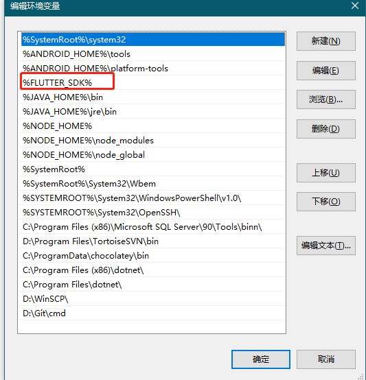

# 文件

## 文件的导入：<mark style="color:blue;background-color:blue;">import</mark>&#x20;

> import 'shape.dart';//同包&#x20;
>
> import '../vec/vec2.dart'; // 相对路径&#x20;
>
> import 'package:idream/grammar/package/01/vec/vec2.dart'; // 项目中绝对路径
>
> import 'conflict2.dart' as c2;//起别名

## 文件内容的显隐：<mark style="color:blue;background-color:blue;">show</mark> 和 <mark style="color:blue;background-color:blue;">hide</mark>

## 部分与整体：<mark style="color:blue;background-color:blue;">part of</mark> 与 <mark style="color:blue;background-color:blue;">part</mark>

&#x20;`part` 文件中不允许提供 `import` 关键字；但在宿主类中导入的包，都可以在 `part` 文件中使用

.png>)

## &#x20;**定义库与导出： **<mark style="color:blue;background-color:blue;">**library**</mark>** 与 **<mark style="color:blue;background-color:blue;">**export**</mark>

