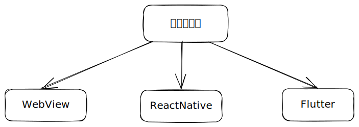

# 移动端跨平台方案

## 背景和问题

> 1、原生开发成本高，不同平台需要找不同的技术人员
>
> 2、有新的功能需要更新时，只能进行版本升级

## 问题方案的选择

### 方案一：WebView

> 最早出现的跨平台框架是基于JavaScript和WebView，代表框架有PhoneGap，Apache Cordova，Ionic等。
>
> **实现方式：**
>
> 原生的网页加载控件 WebView (Android)或 WKWebView（ios）来加载H5构建的页面，本地的一些服务【比如蓝牙、相机等】需要调用JavaScript进行桥接，调用Native的一些代码来完成某些功能。
>
> **优点：**
>
> 开发成本低，版本升级容易，前端开发可以直接入手；
>
> **缺点：**
>
> 性能和体验比较差，体验受限于网络环境、渲染性能、平台特性、浏览器等因素；
>
> 无法调用系统级的 API；

<figure><figcaption></figcaption></figure>

### 方案二：ReactNative

> **实现方式：**
>
> React Native是一种由Facebook开发的框架，基于React的JavaScript框架设计而成。并且在保留基本渲染能力的基础上，用原生自带的UI组件实现核心的渲染引擎，从而保证了良好的渲染性能。
>
> **优点：**
>
> 同时得到原生性能和web应用的灵活性；
>
> **缺点：**
>
> 需要学习React和React Native；

<figure><figcaption></figcaption></figure>

### 方案三：Flutter

> Flutter 是 Google 开源的应用开发框架，仅通过一套代码库，就能构建精美的、原生平台编译的多平台应用，涵盖移动、Web、桌面和嵌入式。
>
> **优点：**
>
> 支持JIT（即时编译）和AOT(运行前编译)；
>
> 更接近原生的性能体验；
>
> 支持平台更广；
>
> 保持平台UI一致性；
>
> **缺点：**
>
> 框架还需要时间的检验；
>
> 官方不支持热更新；

##
